# ssr1.scrape.center Movie List

Scraped from <https://ssr1.scrape.center/> — 100 movies across 10 pages.
Generated by `crawler.py`. Posters are stored in `posters/`.

| # | Poster | Title | Categories | Regions | Minutes | Release | Score | Rating | Detail |
|---|--------|-------|------------|---------|---------|---------|-------|--------|--------|
| 1 |  | 霸王别姬 - Farewell My Concubine | 剧情, 爱情 | 中国内地、中国香港 | 171 分钟 | 1993-07-26 | 9.5 | 4.75 | [link](https://ssr1.scrape.center/detail/1) |
| 2 |  | 这个杀手不太冷 - Léon | 剧情, 动作, 犯罪 | 法国 | 110 分钟 | 1994-09-14 | 9.5 | 4.75 | [link](https://ssr1.scrape.center/detail/2) |
| 3 |  | 肖申克的救赎 - The Shawshank Redemption | 剧情, 犯罪 | 美国 | 142 分钟 | 1994-09-10 | 9.5 | 4.75 | [link](https://ssr1.scrape.center/detail/3) |
| 4 |  | 泰坦尼克号 - Titanic | 剧情, 爱情, 灾难 | 美国 | 194 分钟 | 1998-04-03 | 9.5 | 4.75 | [link](https://ssr1.scrape.center/detail/4) |
| 5 |  | 罗马假日 - Roman Holiday | 剧情, 喜剧, 爱情 | 美国 | 118 分钟 | 1953-08-20 | 9.5 | 4.75 | [link](https://ssr1.scrape.center/detail/5) |
| 6 |  | 唐伯虎点秋香 - Flirting Scholar | 喜剧, 爱情, 古装 | 中国香港 | 102 分钟 | 1993-07-01 | 9.5 | 4.75 | [link](https://ssr1.scrape.center/detail/6) |
| 7 |  | 乱世佳人 - Gone with the Wind | 剧情, 爱情, 历史, 战争 | 美国 | 238 分钟 | 1939-12-15 | 9.5 | 4.75 | [link](https://ssr1.scrape.center/detail/7) |
| 8 |  | 喜剧之王 - The King of Comedy | 剧情, 喜剧, 爱情 | 中国香港 | 85 分钟 | 1999-02-13 | 9.5 | 4.75 | [link](https://ssr1.scrape.center/detail/8) |
| 9 |  | 楚门的世界 - The Truman Show | 剧情, 科幻 | 美国 | 103 分钟 |  | 9.0 | 4.75 | [link](https://ssr1.scrape.center/detail/9) |
| 10 |  | 狮子王 - The Lion King | 动画, 歌舞, 冒险 | 美国 | 89 分钟 | 1995-07-15 | 9.0 | 4.75 | [link](https://ssr1.scrape.center/detail/10) |
| 11 |  | V字仇杀队 - V for Vendetta | 剧情, 动作, 科幻, 惊悚 | 美国、英国、德国 | 132 分钟 | 2005-12-11 | 8.9 | 4.75 | [link](https://ssr1.scrape.center/detail/11) |
| 12 |  | 少年派的奇幻漂流 - Life of Pi | 剧情, 奇幻, 冒险 | 美国、中国台湾、英国、加拿大 | 127 分钟 | 2012-11-22 | 8.9 | 4.75 | [link](https://ssr1.scrape.center/detail/12) |
| 13 |  | 美丽心灵 - A Beautiful Mind | 剧情, 传记 | 美国 | 135 分钟 | 2001-12-13 | 8.8 | 4.75 | [link](https://ssr1.scrape.center/detail/13) |
| 14 |  | 初恋这件小事 - สิ่งเล็กเล็กที่เรียกว่า...รัก | 喜剧, 爱情 | 泰国 | 118 分钟 | 2012-06-05 | 8.9 | 4.75 | [link](https://ssr1.scrape.center/detail/14) |
| 15 |  | 借东西的小人阿莉埃蒂 - 借りぐらしのアリエッティ | 动画, 奇幻, 冒险 | 日本 | 94 分钟 | 2010-07-17 | 8.8 | 4.75 | [link](https://ssr1.scrape.center/detail/15) |
| 16 |  | 一一 - Yi yi: A One and a Two | 剧情, 爱情, 家庭 | 中国台湾、日本 | 173 分钟 | 2000-05-15 | 8.8 | 4.75 | [link](https://ssr1.scrape.center/detail/16) |
| 17 |  | 美丽人生 - La vita è bella | 战争, 剧情, 爱情 | 意大利 | 116 分钟 | 2020-01-03 | 9.1 | 4.75 | [link](https://ssr1.scrape.center/detail/17) |
| 18 |  | 海上钢琴师 - La leggenda del pianista sull'oceano | 剧情, 爱情, 音乐 | 意大利 | 126 分钟 | 2019-11-15 | 9.1 | 4.75 | [link](https://ssr1.scrape.center/detail/18) |
| 19 |  | 千与千寻 - 千と千尋の神隠し | 动画, 冒险, 奇幻, 家庭 | 日本 | 125 分钟 | 2019-06-21 | 9.1 | 4.75 | [link](https://ssr1.scrape.center/detail/19) |
| 20 | 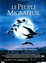 | 迁徙的鸟 - The Travelling Birds | 纪录片 | 法国、德国、意大利、西班牙、瑞士 | 98 分钟 | 2001-12-12 | 9.1 | 4.75 | [link](https://ssr1.scrape.center/detail/20) |
| 21 |  | 黄金三镖客 - Il buono, il brutto, il cattivo. | 西部, 冒险 | 意大利、西班牙、西德 | 161 分钟 | 1966-12-23 | 9.1 | 4.75 | [link](https://ssr1.scrape.center/detail/21) |
| 22 |  | 海洋 - Océans | 纪录片 | 法国、瑞士、西班牙、美国、阿联酋 | 104 分钟 | 2011-08-12 | 9.1 | 4.75 | [link](https://ssr1.scrape.center/detail/22) |
| 23 |  | 我爱你 - 그대를 사랑합니다 | 剧情, 爱情 | 韩国 | 118 分钟 | 2011-02-17 | 9.1 | 4.75 | [link](https://ssr1.scrape.center/detail/23) |
| 24 |  | 阿飞正传 - Days of Being Wild | 剧情, 爱情, 犯罪 | 中国香港 | 94 分钟 | 2018-06-25 | 9.1 | 4.75 | [link](https://ssr1.scrape.center/detail/24) |
| 25 |  | 7号房的礼物 - 7번방의 선물 | 剧情, 喜剧, 家庭 | 韩国 | 127 分钟 | 2013-01-23 | 8.8 | 4.75 | [link](https://ssr1.scrape.center/detail/36) |
| 26 |  | 爱·回家 - 집으로... | 剧情, 家庭 | 韩国 | 80 分钟 | 2002-04-05 | 9.1 | 4.75 | [link](https://ssr1.scrape.center/detail/25) |
| 27 | 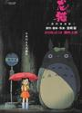 | 龙猫 - となりのトトロ | 动画, 冒险, 奇幻, 家庭 | 日本 | 86 分钟 | 2018-12-14 | 9.1 | 4.75 | [link](https://ssr1.scrape.center/detail/26) |
| 28 |  | 七武士 - 七人の侍 | 剧情, 动作, 冒险 | 日本 | 207 分钟 | 1954-04-26 | 8.8 | 4.75 | [link](https://ssr1.scrape.center/detail/27) |
| 29 | 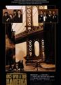 | 美国往事 - Once Upon a Time in America | 剧情, 犯罪 | 意大利、美国 | 229 分钟 | 2015-04-23 | 8.8 | 4.75 | [link](https://ssr1.scrape.center/detail/28) |
| 30 |  | 完美的世界 - A Perfect World | 剧情, 犯罪 | 美国 | 138 分钟 | 1993-11-24 | 8.8 | 4.75 | [link](https://ssr1.scrape.center/detail/29) |
| 31 |  | 上帝之城 - Cidade de Deus | 剧情, 犯罪 | 巴西、法国 | 130 分钟 |  | 8.8 | 4.75 | [link](https://ssr1.scrape.center/detail/30) |
| 32 |  | 辩护人 - 변호인 | 剧情 | 韩国 | 127 分钟 | 2013-12-18 | 8.8 | 4.75 | [link](https://ssr1.scrape.center/detail/31) |
| 33 |  | 忠犬八公物语 - ハチ公物語 | 剧情 | 日本 | 107 分钟 | 1987-08-01 | 8.8 | 4.75 | [link](https://ssr1.scrape.center/detail/32) |
| 34 | 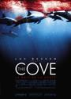 | 海豚湾 - The Cove | 纪录片 | 美国 | 92 分钟 | 2009-07-31 | 8.8 | 4.75 | [link](https://ssr1.scrape.center/detail/33) |
| 35 |  | 英雄本色 - A Better Tomorrow | 剧情, 动作, 犯罪 | 中国香港 | 95 分钟 | 2017-11-17 | 8.8 | 4.75 | [link](https://ssr1.scrape.center/detail/34) |
| 36 |  | 恐怖直播 - 더 테러 라이브 | 剧情, 悬疑, 犯罪 | 韩国 | 97 分钟 | 2013-07-31 | 8.8 | 4.75 | [link](https://ssr1.scrape.center/detail/35) |
| 37 |  | 窃听风暴 - Das Leben der Anderen | 剧情, 悬疑 | 德国 | 137 分钟 | 2006-03-23 | 8.8 | 4.75 | [link](https://ssr1.scrape.center/detail/37) |
| 38 |  | 时空恋旅人 - About Time | 喜剧, 爱情, 奇幻 | 英国 | 123 分钟 | 2013-09-04 | 8.8 | 4.75 | [link](https://ssr1.scrape.center/detail/38) |
| 39 | 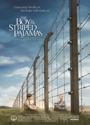 | 穿条纹睡衣的男孩 - The Boy in the Striped Pajamas | 剧情, 战争 | 英国、美国 | 94 分钟 | 2008-08-28 | 8.8 | 4.75 | [link](https://ssr1.scrape.center/detail/39) |
| 40 |  | 教父 - The Godfather | 剧情, 犯罪 | 美国 | 175 分钟 | 2015-04-18 | 8.8 | 4.75 | [link](https://ssr1.scrape.center/detail/40) |
| 41 |  | 萤火之森 - 蛍火の杜へ | 剧情, 爱情, 动画, 奇幻 | 日本 | 45 分钟 | 2011-09-17 | 8.8 | 4.75 | [link](https://ssr1.scrape.center/detail/41) |
| 42 |  | 素媛 - 소원 | 剧情 | 韩国 | 123 分钟 | 2013-10-02 | 8.8 | 4.75 | [link](https://ssr1.scrape.center/detail/42) |
| 43 | 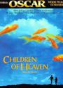 | 小鞋子 - بچههای آسمان | 剧情, 家庭 | 伊朗 | 89 分钟 |  | 8.8 | 4.75 | [link](https://ssr1.scrape.center/detail/43) |
| 44 |  | 熔炉 - 도가니 | 剧情 | 韩国 | 125 分钟 | 2011-09-22 | 8.8 | 4.75 | [link](https://ssr1.scrape.center/detail/44) |
| 45 |  | 大话西游之大圣娶亲 - A Chinese Odyssey Part Two - Cinderella | 喜剧, 爱情, 奇幻 | 中国香港、中国大陆 | 110 分钟 | 2014-10-24 | 8.9 | 4.75 | [link](https://ssr1.scrape.center/detail/45) |
| 46 |  | 新龙门客栈 - New Dragon Gate Inn | 动作, 爱情, 武侠, 古装 | 中国香港、中国大陆 | 88 分钟 | 2012-02-24 | 8.9 | 4.75 | [link](https://ssr1.scrape.center/detail/46) |
| 47 |  | 触不可及 - Intouchables | 剧情, 喜剧 | 法国 | 112 分钟 | 2011-11-02 | 8.9 | 4.75 | [link](https://ssr1.scrape.center/detail/47) |
| 48 |  | 钢琴家 - The Pianist | 剧情, 音乐, 传记, 历史, 战争 | 法国、德国、英国、波兰 | 150 分钟 | 2002-05-24 | 8.9 | 4.75 | [link](https://ssr1.scrape.center/detail/48) |
| 49 |  | 本杰明·巴顿奇事 - The Curious Case of Benjamin Button | 剧情, 爱情, 奇幻 | 美国 | 166 分钟 | 2008-12-25 | 8.9 | 4.75 | [link](https://ssr1.scrape.center/detail/49) |
| 50 |  | 倩女幽魂 - A Chinese Ghost Story | 爱情, 奇幻, 武侠, 古装 | 中国香港 | 98 分钟 | 2011-04-30 | 8.9 | 4.75 | [link](https://ssr1.scrape.center/detail/50) |
| 51 |  | 哈利·波特与死亡圣器（下） - Harry Potter and the Deathly Hallows: Part 2 | 剧情, 悬疑, 奇幻, 冒险 | 英国、美国 | 130 分钟 | 2011-08-04 | 8.9 | 4.75 | [link](https://ssr1.scrape.center/detail/51) |
| 52 |  | 甜蜜蜜 - Comrades: Almost a Love Story | 剧情, 爱情 | 中国香港 | 118 分钟 | 2015-02-13 | 8.9 | 4.75 | [link](https://ssr1.scrape.center/detail/52) |
| 53 | 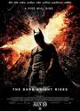 | 蝙蝠侠：黑暗骑士崛起 - The Dark Knight Rises | 剧情, 动作, 科幻, 惊悚, 犯罪 | 美国、英国 | 165 分钟 | 2012-08-27 | 8.9 | 4.75 | [link](https://ssr1.scrape.center/detail/53) |
| 54 |  | 鬼子来了 - Devils on the Doorstep | 剧情, 战争 | 中国大陆 | 139 分钟 | 2000-05-13 | 8.8 | 4.75 | [link](https://ssr1.scrape.center/detail/54) |
| 55 |  | 无敌破坏王 - Wreck-It Ralph | 喜剧, 动画, 奇幻, 冒险 | 美国 | 101 分钟 | 2012-11-06 | 8.8 | 4.75 | [link](https://ssr1.scrape.center/detail/55) |
| 56 |  | 致命魔术 - The Prestige | 剧情, 悬疑, 惊悚 | 美国、英国 | 130 分钟 | 2006-10-17 | 8.8 | 4.75 | [link](https://ssr1.scrape.center/detail/56) |
| 57 | 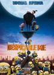 | 神偷奶爸 - Despicable Me | 喜剧, 动画, 冒险 | 美国、法国 | 95 分钟 | 2010-06-20 | 8.8 | 4.75 | [link](https://ssr1.scrape.center/detail/57) |
| 58 |  | 断背山 - Brokeback Mountain | 剧情, 爱情, 家庭 | 美国、加拿大 | 134 分钟 | 2005-09-02 | 8.8 | 4.75 | [link](https://ssr1.scrape.center/detail/58) |
| 59 |  | 怦然心动 - Flipped | 剧情, 喜剧, 爱情 | 美国 | 90 分钟 | 2010-07-26 | 8.8 | 4.75 | [link](https://ssr1.scrape.center/detail/59) |
| 60 | 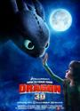 | 驯龙高手 - How to Train Your Dragon | 喜剧, 动画, 奇幻, 冒险 | 美国 | 98 分钟 | 2010-05-14 | 8.8 | 4.75 | [link](https://ssr1.scrape.center/detail/60) |
| 61 |  | 飞屋环游记 - Up | 剧情, 喜剧, 动画, 冒险 | 美国 | 96 分钟 | 2009-08-04 | 8.8 | 4.75 | [link](https://ssr1.scrape.center/detail/61) |
| 62 |  | 黑客帝国3：矩阵革命 - The Matrix Revolutions | 动作, 科幻 | 美国、澳大利亚 | 129 分钟 | 2003-11-05 | 8.8 | 4.75 | [link](https://ssr1.scrape.center/detail/62) |
| 63 |  | 速度与激情5 - Fast Five | 动作, 犯罪 | 美国 | 130 分钟 | 2011-05-12 | 8.9 | 4.75 | [link](https://ssr1.scrape.center/detail/63) |
| 64 |  | 勇敢的心 - Braveheart | 剧情, 动作, 传记, 历史, 战争 | 美国 | 177 分钟 | 1995-05-18 | 8.9 | 4.75 | [link](https://ssr1.scrape.center/detail/64) |
| 65 |  | 三傻大闹宝莱坞 - 3 Idiots | 剧情, 喜剧, 爱情, 歌舞 | 印度 | 171 分钟 | 2011-12-08 | 8.9 | 4.75 | [link](https://ssr1.scrape.center/detail/65) |
| 66 |  | 闻香识女人 - Scent of a Woman | 剧情 | 美国 | 157 分钟 | 1992-12-23 | 8.9 | 4.75 | [link](https://ssr1.scrape.center/detail/66) |
| 67 |  | 末代皇帝 - The Last Emperor | 剧情, 传记, 历史 | 英国、意大利、中国大陆、法国、美国 | 163 分钟 | 1987-10-23 | 8.9 | 4.75 | [link](https://ssr1.scrape.center/detail/67) |
| 68 |  | 风之谷 - 風の谷のナウシカ | 动画, 奇幻, 冒险 | 日本 | 117 分钟 |  | 8.9 | 4.75 | [link](https://ssr1.scrape.center/detail/68) |
| 69 |  | 大话西游之月光宝盒 - A Chinese Odyssey | 喜剧, 爱情, 奇幻, 古装 | 中国香港、中国大陆 | 87 分钟 | 2014-10-24 | 8.9 | 4.75 | [link](https://ssr1.scrape.center/detail/69) |
| 70 |  | 放牛班的春天 - Les choristes | 剧情, 音乐 | 法国、德国、瑞士 | 97 分钟 | 2004-10-16 | 8.9 | 4.75 | [link](https://ssr1.scrape.center/detail/70) |
| 71 |  | 当幸福来敲门 - The Pursuit of Happyness | 剧情, 家庭, 传记 | 美国 | 117 分钟 | 2008-01-17 | 8.9 | 4.75 | [link](https://ssr1.scrape.center/detail/71) |
| 72 |  | 幽灵公主 - もののけ姫 | 动画, 奇幻, 冒险 | 日本 | 134 分钟 | 1998-05-01 | 8.9 | 4.75 | [link](https://ssr1.scrape.center/detail/72) |
| 73 | 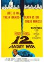 | 十二怒汉 - 12 Angry Men | 剧情 | 美国 | 96 分钟 | 1957-04-13 | 8.9 | 4.75 | [link](https://ssr1.scrape.center/detail/73) |
| 74 |  | 搏击俱乐部 - Fight Club | 剧情, 动作, 悬疑, 惊悚 | 美国、德国 | 139 分钟 | 1999-09-10 | 8.9 | 4.75 | [link](https://ssr1.scrape.center/detail/74) |
| 75 |  | 疯狂原始人 - The Croods | 喜剧, 动画, 冒险 | 美国 | 98 分钟 | 2013-04-20 | 8.9 | 4.75 | [link](https://ssr1.scrape.center/detail/75) |
| 76 |  | 阿凡达 - Avatar | 动作, 科幻, 冒险 | 美国、英国 | 162 分钟 | 2010-01-04 | 8.9 | 4.75 | [link](https://ssr1.scrape.center/detail/76) |
| 77 |  | 哈尔的移动城堡 - ハウルの動く城 | 动画, 奇幻, 冒险 | 日本 | 119 分钟 | 2004-09-05 | 8.9 | 4.75 | [link](https://ssr1.scrape.center/detail/77) |
| 78 | 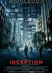 | 盗梦空间 - Inception | 剧情, 科幻, 悬疑, 冒险 | 美国、英国 | 148 分钟 | 2010-09-01 | 8.9 | 4.75 | [link](https://ssr1.scrape.center/detail/78) |
| 79 |  | 忠犬八公的故事 - Hachi: A Dog's Tale | 剧情 | 美国、英国 | 93 分钟 | 2009-06-13 | 8.9 | 4.75 | [link](https://ssr1.scrape.center/detail/79) |
| 80 |  | 拯救大兵瑞恩 - Saving Private Ryan | 剧情, 历史, 战争 | 美国 | 169 分钟 | 1998-11-13 | 8.9 | 4.75 | [link](https://ssr1.scrape.center/detail/80) |
| 81 |  | 活着 - To Live | 剧情, 家庭, 历史 | 中国大陆、中国香港 | 132 分钟 | 1994-05-17 | 9.0 | 4.75 | [link](https://ssr1.scrape.center/detail/81) |
| 82 |  | 机器人总动员 - WALL·E | 喜剧, 科幻, 动画 | 美国 | 98 分钟 | 2008-06-27 | 9.0 | 4.75 | [link](https://ssr1.scrape.center/detail/82) |
| 83 |  | 天堂电影院 - Nuovo Cinema Paradiso | 剧情, 爱情 | 意大利、法国 | 155 分钟 | 1988-11-17 | 9.0 | 4.75 | [link](https://ssr1.scrape.center/detail/83) |
| 84 |  | 指环王2：双塔奇兵 - The Lord of the Rings: The Two Towers | 剧情, 动作, 奇幻, 冒险 | 美国、新西兰 | 179 分钟 | 2003-04-25 | 9.0 | 4.75 | [link](https://ssr1.scrape.center/detail/84) |
| 85 |  | 指环王1：护戒使者 - The Lord of the Rings: The Fellowship of the Ring | 剧情, 动作, 奇幻, 冒险 | 新西兰、美国 | 178 分钟 | 2002-04-04 | 9.0 | 4.75 | [link](https://ssr1.scrape.center/detail/85) |
| 86 |  | 射雕英雄传之东成西就 - The Eagle Shooting Heroes | 喜剧, 奇幻, 武侠, 古装 | 中国香港 | 113 分钟 | 1993-02-05 | 9.0 | 4.75 | [link](https://ssr1.scrape.center/detail/86) |
| 87 |  | 蝙蝠侠：黑暗骑士 - The Dark Knight | 剧情, 动作, 科幻, 惊悚, 犯罪 | 美国、英国 | 152 分钟 | 2008-07-14 | 9.0 | 4.75 | [link](https://ssr1.scrape.center/detail/87) |
| 88 |  | 无间道 - Infernal Affairs | 剧情, 悬疑, 犯罪 | 中国香港 | 101 分钟 | 2003-09-05 | 9.0 | 4.75 | [link](https://ssr1.scrape.center/detail/88) |
| 89 |  | 教父2 - The Godfather: Part Ⅱ | 剧情, 犯罪 | 美国 | 202 分钟 | 1974-12-12 | 9.0 | 4.75 | [link](https://ssr1.scrape.center/detail/89) |
| 90 |  | 加勒比海盗 - Pirates of the Caribbean: The Curse of the Black Pearl | 动作, 奇幻, 冒险 | 美国 | 143 分钟 | 2003-11-21 | 9.0 | 4.75 | [link](https://ssr1.scrape.center/detail/90) |
| 91 |  | 哈利·波特与魔法石 - Harry Potter and the Sorcerer's Stone | 奇幻, 冒险 | 美国、英国 | 152 分钟 | 2002-01-26 | 9.0 | 4.75 | [link](https://ssr1.scrape.center/detail/91) |
| 92 |  | 指环王3：王者无敌 - The Lord of the Rings: The Return of the King | 剧情, 动作, 奇幻, 冒险 | 美国、新西兰 | 201 分钟 | 2004-03-15 | 9.0 | 4.75 | [link](https://ssr1.scrape.center/detail/92) |
| 93 |  | 黑客帝国 - The Matrix | 动作, 科幻 | 美国、澳大利亚 | 136 分钟 | 2000-01-14 | 9.0 | 4.75 | [link](https://ssr1.scrape.center/detail/93) |
| 94 |  | 剪刀手爱德华 - Edward Scissorhands | 剧情, 爱情, 奇幻 | 美国 | 105 分钟 | 1990-12-06 | 9.0 | 4.75 | [link](https://ssr1.scrape.center/detail/94) |
| 95 |  | 春光乍泄 - Happy Together | 剧情, 爱情 | 中国香港、日本、韩国 | 96 分钟 | 1997-05-17 | 9.0 | 4.75 | [link](https://ssr1.scrape.center/detail/95) |
| 96 | 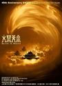 | 大闹天宫 - The Monkey King | 动画, 奇幻 | 中国大陆 | 114 分钟 | 1965-12-31 | 9.0 | 4.75 | [link](https://ssr1.scrape.center/detail/96) |
| 97 |  | 天空之城 - 天空の城ラピュタ | 动画, 奇幻, 冒险 | 日本 | 125 分钟 | 1992-05-01 | 9.0 | 4.75 | [link](https://ssr1.scrape.center/detail/97) |
| 98 |  | 音乐之声 - The Sound of Music | 剧情, 爱情, 歌舞, 传记 | 美国 | 174 分钟 | 1965-03-02 | 9.0 | 4.75 | [link](https://ssr1.scrape.center/detail/98) |
| 99 |  | 辛德勒的名单 - Schindler's List | 剧情, 历史, 战争 | 美国 | 195 分钟 | 1993-11-30 | 9.5 | 4.75 | [link](https://ssr1.scrape.center/detail/99) |
| 100 |  | 魂断蓝桥 - Waterloo Bridge | 剧情, 爱情, 战争 | 美国 | 108 分钟 | 1940-05-17 | 9.5 | 4.75 | [link](https://ssr1.scrape.center/detail/100) |
